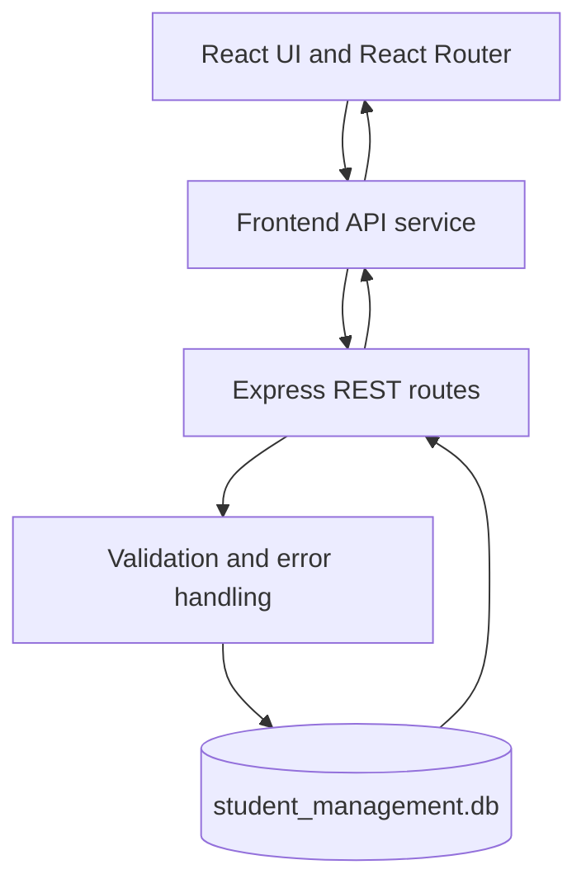
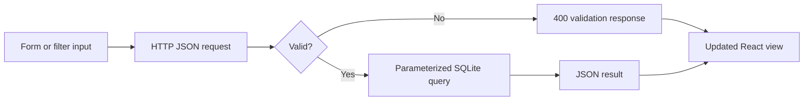
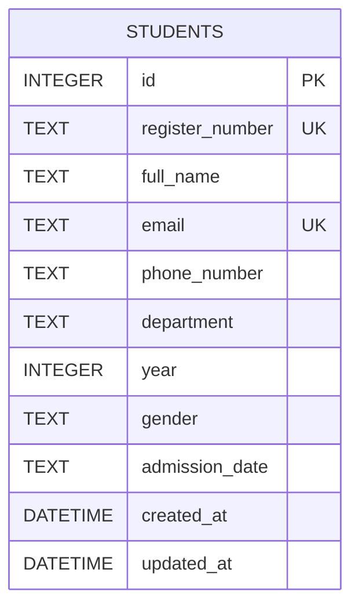
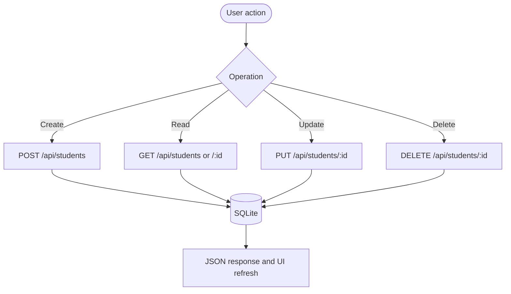

# Student Management System
## Academic Project Report

### Title page

**Project:** CampusCore — Student Management System  
**Project type:** Full-stack CRUD web application  
**Prepared by:** B.Tech Information Technology student  
**Academic year:** 2025–2026  

> Replace the student name, register number, institution, department, and guide details before submission.

## Abstract

CampusCore is a web-based student management system that helps an authorized operator create, view, update, search, filter, and delete college student records. The application combines a responsive React dashboard with an Express REST API and SQLite persistence. It applies validation at the user-interface and server layers, reports duplicate data clearly, and includes summary views for academic years and departments. The design is intentionally simple to demonstrate the core principles of a maintainable full-stack CRUD application.

## 1. Introduction

Institutions need accurate student records for administration and academic activities. A small, focused web application can make common record operations faster and less error-prone than disconnected manual files.

## 2. Problem statement

Paper records and unstructured spreadsheets make it difficult to find a student, verify uniqueness, update contact information, or understand the overall distribution of students by department and year.

## 3. Objectives

1. Build a working full-stack CRUD application.
2. Persist records in a SQLite database.
3. Provide an accessible and responsive user interface.
4. Validate input and handle common API errors.
5. Document the system, database, API, and testing procedure.

## 4. Scope

The system manages student records for a college activity prototype. It includes directory management, search, filtering, detail views, and dashboard summaries. Authentication, multi-user permissions, bulk import, and production hosting are outside the current scope.

## 5. Existing system and proposed system

The existing approach may rely on paper registers or separate spreadsheet files. The proposed system provides a central browser interface backed by a structured database and a documented API. This reduces duplicate entry and makes common lookups consistent.

## 6. Functional requirements

- Create a student with valid personal and academic information.
- Read all students or one student by ID.
- Update an existing student.
- Delete a student after confirmation.
- Search by name, register number, or email.
- Filter by department and year.
- Display dashboard totals and recent records.
- Show useful errors for invalid, duplicate, and missing data.

## 7. Non-functional requirements

- Responsive on desktop, tablet, and mobile.
- Use parameterized database operations.
- Keep secrets out of source control.
- Return JSON from API endpoints.
- Keep frontend and backend responsibilities separate.
- Initialize the database automatically.

## 8. Software and hardware requirements

**Software:** Node.js 18+, npm, a modern browser, and an optional Postman installation.  
**Hardware:** Any computer capable of running Node.js and a browser; 4 GB RAM is sufficient for local development.

## 9. System architecture

## 10. Data flow explanation

1. The user enters a record or filter in the React interface.
2. The frontend sends an HTTP request to an Express endpoint.
3. The server validates input and normalizes whitespace/case-sensitive fields.
4. A parameterized SQLite query reads or changes the record.
5. The server returns JSON with a status code and user-facing message.
6. React updates the table, dashboard, or detail view.

## 11. Database design

There is one primary entity, `students`. It contains identity, contact, course, and admission details. `register_number` and `email` are unique, while `year` has a database check constraint from 1 through 4.

## 12. Frontend implementation

The client is organized around a shell with persistent navigation, dashboard cards, reusable form fields, empty/loading states, notifications, and responsive layouts. React Router provides dashboard, directory, add, edit, and detail views. The API wrapper keeps fetch behavior and error normalization in one place.

## 13. Backend implementation

Express handles JSON requests, CORS, static production files, route matching, and centralized error responses. `better-sqlite3` provides synchronous, parameterized statements that are appropriate for this small local application. The schema and indexes are run when the database module loads.

## 14. CRUD operations

## 15. API documentation

| Endpoint | Purpose | Success | Common errors |
| --- | --- | --- | --- |
| `GET /api/students` | List/search/filter records | 200 | 500 |
| `GET /api/students/:id` | Detail view | 200 | 404 |
| `POST /api/students` | Add record | 201 | 400, 409 |
| `PUT /api/students/:id` | Edit record | 200 | 400, 404, 409 |
| `DELETE /api/students/:id` | Remove record | 200 | 404 |
| `GET /api/dashboard/stats` | Summary cards and lists | 200 | 500 |

## 16. Validation and error handling

Required fields, names, email format, phone format, department, year, gender, and ISO admission dates are validated before database writes. The database unique constraints protect against race conditions and the API maps those conflicts to HTTP 409. Unknown IDs return HTTP 404. Malformed JSON returns HTTP 400.

## 17. Testing and results

The executable API test suite is in `tests/api.test.js`. It uses a temporary SQLite database and records whether create, validation, duplicate handling, read, update, delete, search, filters, and dashboard statistics work. The human-readable matrix is in `TESTING.md`.

Do not treat a test as complete unless its command has actually been run. Browser screenshots and mobile checks are intentionally left for the student to perform in the running application.

## 18. Screenshots

Capture and insert screenshots from the running application at these placeholders:

1. **Figure 1 — Dashboard:** `[Insert dashboard screenshot here]`
2. **Figure 2 — Student management table:** `[Insert directory screenshot here]`
3. **Figure 3 — Add student form:** `[Insert form screenshot here]`
4. **Figure 4 — Student details:** `[Insert detail screenshot here]`
5. **Figure 5 — Mobile layout:** `[Insert mobile screenshot here]`

## 19. Challenges and solutions

- Persistent data was solved with automatic SQLite schema setup.
- User-friendly duplicate errors were solved by mapping SQLite constraint errors to field-level JSON errors.
- Different screen sizes were addressed through responsive grid breakpoints and horizontal table scrolling.
- Empty and loading states prevent confusing blank screens during API requests.

## 20. Future enhancements

Authentication, roles, pagination, CSV import/export, audit history, automated browser testing, and cloud database deployment would be logical next steps.

## 21. Conclusion

CampusCore demonstrates a complete, maintainable CRUD workflow with a React frontend, Express API, SQLite database, validation, search, filters, and documentation. Its structure is suitable for academic demonstration while leaving clear extension points for a larger deployment.

## 22. References

- React documentation: https://react.dev/
- Express documentation: https://expressjs.com/
- SQLite documentation: https://www.sqlite.org/docs.html
- Vite documentation: https://vite.dev/
- MDN Web Docs: https://developer.mozilla.org/