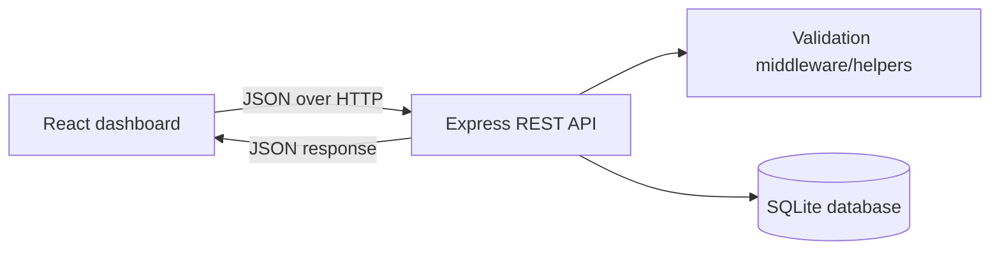

# CampusCore — Student Management System

CampusCore is a full-stack CRUD web application for managing college student records. It uses React for the responsive dashboard, Express for the REST API, and SQLite for durable local persistence.

## Problem statement

Student details are often maintained in disconnected spreadsheets or paper records. That makes searching, updating, and maintaining consistent information difficult. CampusCore gives an authorized college operator a single interface to manage the student directory and review useful summary information.

## Objectives

- Store student records in a real SQLite database.
- Provide complete create, read, update, and delete functionality.
- Validate user input in both the browser and the API.
- Support search by name, register number, and email.
- Filter records by department and academic year.
- Present a clean, responsive dashboard suitable for a college demonstration.
- Keep the code readable, modular, and easy to extend.

## Features

- Dashboard summary cards and year/department distributions
- Recent student records
- Student directory with responsive table
- Add, edit, view, and delete student records
- Search and department/year filters
- Duplicate register number and email detection
- Confirmation before deletion
- Loading, empty, success, and error states
- Parameterized SQLite queries
- REST API suitable for Postman
- Mermaid architecture, CRUD, ER, and data-flow diagrams

## Technology stack

| Layer | Technology |
| --- | --- |
| Frontend | React 18, React Router, Vite, CSS3 |
| Backend | Node.js, Express.js |
| Database | SQLite through better-sqlite3 |
| Icons | lucide-react |
| Configuration | dotenv and environment variables |

## Architecture

The Vite React client calls the Express API with JSON. The API validates and normalizes payloads before executing parameterized SQLite queries. In production mode, Express also serves the built React client.



## Database design

The database is created automatically at `data/student_management.db` when the server starts. The schema lives in `database/schema.sql`.

The `students` table contains:

| Column | Type | Rules |
| --- | --- | --- |
| id | INTEGER | Primary key, auto-increment |
| register_number | TEXT | Required and unique |
| full_name | TEXT | Required |
| email | TEXT | Required and unique |
| phone_number | TEXT | Optional |
| department | TEXT | Required |
| year | INTEGER | Required, 1–4 |
| gender | TEXT | Optional |
| admission_date | TEXT | Required, ISO date |
| created_at | DATETIME | Automatic creation timestamp |
| updated_at | DATETIME | Automatic update timestamp |

Indexes are provided for department, year, name, and admission date.

## REST API

Base URL: `http://localhost:3000/api`

| Method | Endpoint | Description |
| --- | --- | --- |
| GET | `/health` | Health check |
| GET | `/students` | List all students; accepts `search`, `department`, and `year` |
| GET | `/students/search?q=...` | Search by name, register number, or email |
| GET | `/students/:id` | Get one student |
| POST | `/students` | Create a student |
| PUT | `/students/:id` | Update a student |
| DELETE | `/students/:id` | Delete a student |
| GET | `/dashboard/stats` | Dashboard totals, department counts, year counts, and five recent records |

Example request:

```json
{
  "register_number": "IT2026001",
  "full_name": "Ravi Kumar",
  "email": "ravi@example.com",
  "phone_number": "9876543210",
  "department": "Information Technology",
  "year": 2,
  "gender": "Male",
  "admission_date": "2025-08-01"
}
```

Successful writes return a JSON object with `success`, `message`, and (for create/update) `data`. Validation errors return HTTP 400 with an `errors` object. Duplicate register numbers or emails return HTTP 409. Missing records return HTTP 404.

## Project structure

```text
student-management-system/
├── database/schema.sql
├── server/
│   ├── app.js
│   ├── database.js
│   └── validation.js
├── src/
│   ├── api.js
│   ├── App.jsx
│   ├── main.jsx
│   └── styles.css
├── tests/api.test.js
├── .env.example
├── index.html
├── package.json
├── PROJECT_REPORT.md
├── README.md
└── TESTING.md
```

## Installation and local run

1. Install Node.js 18 or newer.
2. Install dependencies:

   ```bash
   npm install
   ```

3. Copy `.env.example` to `.env` if you need to customize the port or database location.
4. Start the API and frontend together:

   ```bash
   npm run dev
   ```

5. Open the Vite URL shown in the terminal, normally `http://localhost:5173`.

For a production-style run:

```bash
npm start
```

The command builds the client and then starts Express, which serves the application at `http://localhost:3000`.

## Running in Replit

- Import the project ZIP or upload the project folder.
- Run `npm install`.
- Use `npm run dev` for development with the Vite preview.
- For a single server process, run `npm start`.
- The database is initialized automatically; no manual migration command is needed.
- Keep `.env` private. Use Replit Secrets or environment variables for deployment-specific values.

## Testing

Run the automated API checks with:

```bash
npm test
```

The complete test-case matrix and recorded results are in `TESTING.md`. Browser responsiveness should also be checked at a narrow mobile viewport using the running application.

## GitHub upload

```bash
git init
git add .
git commit -m "Build CampusCore student management system"
git branch -M main
git remote add origin https://github.com/<your-username>/<repository>.git
git push -u origin main
```

Do not commit `.env`, the generated SQLite database, or `node_modules`.

## Challenges and solutions

- **Durable records:** SQLite replaces temporary in-memory arrays, and the database is initialized on startup.
- **Duplicate data:** database unique constraints are combined with clear API conflict responses.
- **Responsive data table:** the table keeps readable columns and scrolls horizontally on small screens while the rest of the dashboard collapses to one column.
- **Consistent validation:** the same business rules are represented in the form UI and server-side validation; the API remains the final authority.

## Future enhancements

- Add authenticated user accounts and role-based permissions.
- Add pagination and CSV export for larger directories.
- Add audit history for record changes.
- Add bulk import with a CSV template.
- Add automated browser tests for navigation and responsive layouts.